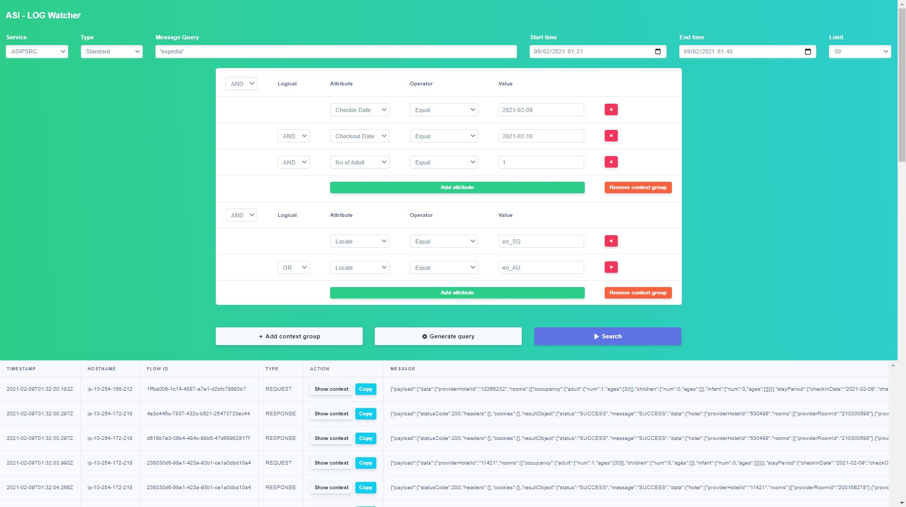

# ASI-Log Watcher
##### S3 log viewer (local version)


### Prerequisites
Go `1.13+` to build a binary

**Linux**
```
AWS CLI 
https://docs.aws.amazon.com/cli/latest/userguide/install-cliv2-linux.html

Awsudo
https://github.com/makethunder/awsudo
```

**Windows**
```
AWS CLI
https://docs.aws.amazon.com/cli/latest/userguide/install-cliv2-windows.html

Saml2aws
https://github.com/Versent/saml2aws
```

### How to build?
**Linux**
```
make build                      # this cmd will generate logwatcher binary
```
**Windows**
```
make build_windows              # this cmd will generate logwatcher.exe binary
```

### How to run?
**Linux**
```
awsudo -u ReadOnly@tvlk-asi-prod -- ./logwatcher
```
**Windows**
```
saml2aws login
saml2aws exec --exec-profile ReadOnly@tvlk-asi-prod logwatcher
```