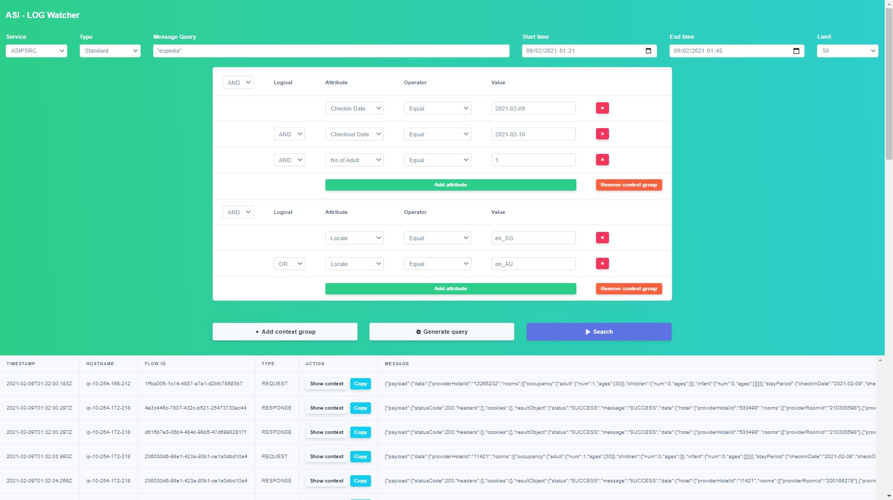

# ASI-Log Watcher
##### S3 log viewer (local version)

> Screenshot above will generate and execute query like this
```
SELECT 
  timestamp, 
  message, 
  flowid, 
  type, 
  hostname, 
  part, 
  context.correlationid, 
  context.providerid, 
  context.event, 
  context.sourcemarket, 
  context.checkindate, 
  context.checkoutdate, 
  context.locale, 
  context.currency, 
  context.noofadult, 
  context.noofchild, 
  context.noofroom 
FROM 
  "s3log"."psrclogrqrs_init" 
WHERE 
  datekey = '2021020901' 
  AND timestamp >= '2021-02-09T01:21' 
  AND timestamp <= '2021-02-09T01:45' 
  AND (
    context.checkindate = '2021-02-09' 
    AND context.checkoutdate = '2021-02-10' 
    AND context.noofadult = 1
  ) 
  AND (
    context.locale = 'en_SG' 
    OR context.locale = 'en_AU'
  ) 
  AND message LIKE '%expedia%' 
LIMIT 
  50
```
### Prerequisites
Go `1.13+` to build a binary

**Linux**
```
AWS CLI 
https://docs.aws.amazon.com/cli/latest/userguide/install-cliv2-linux.html

Awsudo
https://github.com/makethunder/awsudo
```

**Windows**
```
AWS CLI
https://docs.aws.amazon.com/cli/latest/userguide/install-cliv2-windows.html

Saml2aws
https://github.com/Versent/saml2aws
```

### How to build?
**Linux**
```
make build                      # this cmd will generate logwatcher binary
```
**Windows**
```
make build_windows              # this cmd will generate logwatcher.exe binary
```

### How to run?
1. Open your terminal or command prompt
2. Go to `dist` folder. `# you can copy and paste this folder wherever you want`
3. Then execute this cmd :

**Linux**
```
awsudo -u ReadOnly@tvlk-asi-prod -- ./logwatcher
```
**Windows**
```
saml2aws login
saml2aws exec --exec-profile ReadOnly@tvlk-asi-prod logwatcher
```